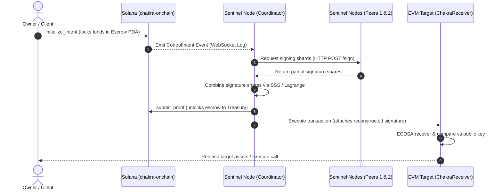

# CHAKRA Architecture Specification
*Complete Data Flow, Component Structure, and Security Boundaries*

---

## 1. System Overview

CHAKRA coordinates cross-chain execution using Solana as the "universal mainframe". Sentinel nodes run a Threshold Signature Scheme (TSS) over a split private key. By registering the public key on-chain, Solana smart contracts can lock local funds in escrow and authorize execution on the target chain using signatures verified trustlessly.

---

## 2. System Architecture Diagram

### 2.1 Mermaid Diagram



### 2.2 ASCII Diagram

```
 [ User ]
    │
    │ 1. initialize_intent
    ▼
┌──────────────────────────────┐
│  Solana Program (onchain)    │ ◄────────────────────────┐
│  - Locks lamports in PDA     │                          │
│  - Emits ControlIntent event │                          │
└──────────────┬───────────────┘                          │
               │                                          │ 5. submit_proof
               │ 2. WebSockets log stream                 │    (resolves Solana state)
               ▼                                          │
┌──────────────────────────────┐                          │
│  Sentinel Coordinator (Rust) ├──────────────────────────┘
│  - Hashes intent parameters  │
│  - Performs SSS combination  │ ◄────────────────────────┐
└──────────────┬───────────────┘                          │ 3. HTTP /sign
               │                                          │    requests
               │ 4. Send transaction                      │
               ▼                                          │
┌──────────────────────────────┐                 ┌────────┴────────┐
│   EVM target chain (Base)    │                 │ Sentinel Peer 1 │
│  - Verifies proof signature  │                 ├─────────────────┤
│  - Releases native assets    │                 │ Sentinel Peer 2 │
└──────────────────────────────┘                 └─────────────────┘
```

---

## 3. Security Boundaries & Assumptions

1.  **Trustless Solana On-chain state:** Solana acts as the single source of truth for whether a transaction has been initialized or has timed out. 
2.  **Sentinel Network Liveness:** A 2-of-3 threshold is enforced. If two nodes go down, the network stalls, but the user's funds are completely protected because they can cancel the intent on-chain after the `timeout_slot` is reached.
3.  **Honeypot-Free Destination:** Rather than a bridge contract acting as a massive pool of funds, the target accounts are owned by the TSS public key. There is no central pool to drain.
