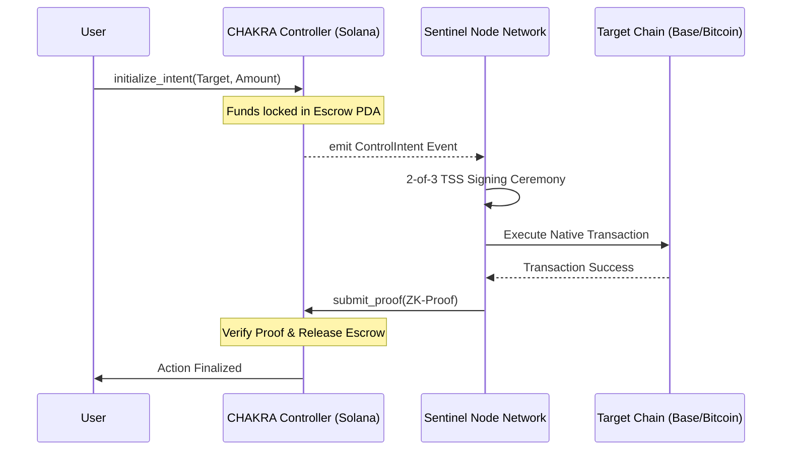

# CHAKRA Mainframe: The Universal Command Layer

CHAKRA is a developer tooling protocol that turns Solana into a **Universal Mainframe** — allowing any Solana program to natively own and execute transactions on Bitcoin, Ethereum, and Base accounts without bridges or wrapped assets.

This repository contains the **CHAKRA Controller**, the on-chain brain deployed on Solana.

## 🏗 System Architecture

## 🛠 Project Structure

- `programs/chakra-mainframe/src/instructions/`: Modular instruction handlers.
- `programs/chakra-mainframe/src/state/`: Binary account structures (EscrowState).
- `programs/chakra-mainframe/src/errors/`: Custom protocol error codes.
- `programs/chakra-mainframe/src/events/`: Cross-chain intent emission logic.

## Current Implementation Status

| Component | Status | Technical Detail |
| :--- | :--- | :--- |
| **Solana Program** | ✅ Live | Escrow, Cancel, and TSS Proof verification active on Devnet. |
| **TSS Signing** | ⚙️ POC | Shamir SSS with Distributed Partial Combination (2-of-3). |
| **Sentinel Node** | ✅ Active | Multi-process HTTP network with independent shard signing. |
| **MPC Upgrade** | 🚀 Planned | Transition to true MPC-ECDSA (FROST) scheduled for Milestone 2. |
| **Base Loop** | ⏳ Pending | ChakraReceiver deployment and Sentinel-to-Base execution. |

## ⚖️ License

All code is released under the **MIT License**. Build the future of Solana natively.
